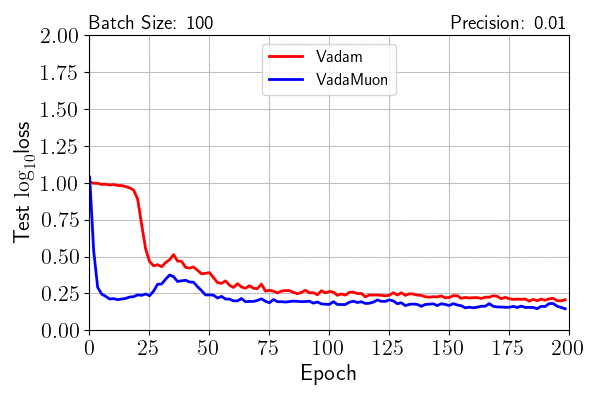

# PyTorch implementation of Bayesian neural network experiments on MNIST.

This directory contains the PyTorch implementation of the VadaMuon experiments on the MNIST dataset. 

## Scripts explanation:
There are 5 python scripts:
* `run_experiments.py` - This is the main script to run experiments.
* `experiments.py` - This script implements experiment classes for Vadam, BBVI (not tested) and VadaMuon.
* `produce_gifs.py` - This script is for producing the animated GIFs and their corresponded frames. It loads files produced by `run_experiments.py`.
* `produce_csv.py` which reads the files produced by `run_experiment.py` and creates a summary table.
* `analysis.ipynb` contains some values computed for the report.

To run the script, if you are using uv type in `uv run <script.py>` in this folder. If you are using pip instead, make sure that the environment is active.

### How to run experiments:
Experiments can be run using `run_experiments.py`.
This script will store its results in `results/`.
The final results obtained from our run are provided in `results/results.zip`.
By extracting the contents of this file to `results/`, the plots in the paper can be reproduced exactly.

### How to plot the results:
The animated GIFs and their corresponding frames can be produced using `produce_gifs.py`.
This scripts loads results from `results/` and saves the animated GIFs in `animations/`. The frames are saved into `animations/frames/`.
By extracting `results/results.zip`, which contains results obtained from our run, the plots can be reproduced exactly.
We already profide the GIFs in the `animations/` folder and the frames are inside the corriesponding zip file at `animations/frames.zip`.

### How to summarize the results:
A summary of the results of our run can be found in the file `results/summary.csv`. To generate the file, extract the `results/results.zip` file and run the `produce_csv.py` script.

### How to analyze the results:
To analyze the results using the notebook `analysis.ipynb`, the file `summary.csv` must be present in the `results/` folder. 
